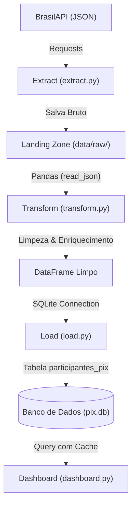

# Pipeline ETL & Dashboard de Participantes do PIX 📊

Este projeto é um pipeline de Engenharia de Dados ponta a ponta (End-to-End) que extrai dados da API pública de participantes do PIX da **BrasilAPI**, limpa e transforma esses dados utilizando **Python** e **Pandas**, carrega-os em um banco de dados relacional **SQLite** local e exibe análises interativas através de um dashboard construído com **Streamlit** e **Altair**.

O objetivo deste projeto é demonstrar a estruturação de um pipeline de dados profissional, utilizando modularização de código, boas práticas de Data Lake, bancos de dados relacionais locais e criação de interfaces de dados eficientes e leves.

---

## 🛠️ Arquitetura do Pipeline

O pipeline de dados segue a estrutura modular clássica de engenharia de software:



1. **Extract**: Consome a API pública e salva os arquivos brutos em formato JSON em `data/raw/` com timestamps. Isso garante a rastreabilidade (linhagem do dado) e evita a necessidade de re-consultar a API caso o pipeline quebre na transformação.
2. **Transform**: Carrega o JSON mais recente, remove linhas de metadados indesejados retornados pela API, remove valores nulos em colunas obrigatórias, limpa espaços em branco e cria uma nova classificação (`categoria_instituicao`) identificando se o participante é um **Banco**, **Cooperativa**, **Fintech / IP** ou **Outros**.
3. **Load**: Insere os dados tratados de forma otimizada em uma tabela SQLite chamada `participantes_pix`.
4. **Dashboard**: Exibe análises rápidas com cartões de KPIs (Total de participantes, proporção direta/indireta) e gráficos interativos de ranking ordenados dinamicamente usando Altair.

---

## 🚀 Tecnologias e Ferramentas Utilizadas

* **Python 3.9+** (Linguagem principal)
* **Pandas & NumPy** (Manipulação e higienização dos dados)
* **SQLite** (Armazenamento estruturado local)
* **Streamlit & Altair** (Dashboard analítico leve e interativo)
* **uv** (Gerenciamento ultra-rápido de ambiente virtual e dependências)

---

## 📁 Estrutura do Repositório

```text
1_etl_portfolio/
├── data/
│   ├── raw/          <-- Arquivos JSON brutos extraídos da API (Landing Zone)
│   └── processed/    <-- Banco de dados SQLite contendo a tabela tratada
├── notebook/
│   └── exploration.ipynb <-- Notebook utilizado na fase de rascunho e análise exploratória
├── src/
│   ├── extract.py    <-- Código de consumo da API e persistência bruta
│   ├── transform.py  <-- Processamento, limpeza e enriquecimento de dados
│   └── load.py       <-- Escrita estruturada no SQLite
├── dashboard.py      <-- Interface visual e analítica interativa no Streamlit
├── main.py           <-- Orquestrador central do ETL
├── pyproject.toml    <-- Dependências declaradas do projeto
└── README.md         <-- Documentação do projeto
```

---

## 🔧 Como Executar o Projeto

### 1. Clonar o Repositório
```bash
git clone https://github.com/NathiNanda/etl-participants-pix.git
cd etl-participants-pix
```

### 2. Instalar as Dependências (usando `uv`)
Caso utilize o gerenciador `uv`, execute na raiz:
```bash
uv sync
```
*Caso não utilize, você pode rodar em seu próprio ambiente virtual:*
```bash
pip install pandas requests streamlit sqlalchemy altair
```

### 3. Rodar o Pipeline de ETL
Execute o orquestrador para extrair, transformar e carregar os dados brutos no banco:
```bash
python main.py
```

### 4. Iniciar o Dashboard
Execute o Streamlit para abrir a visualização interativa no seu navegador:
```bash
streamlit run dashboard.py
```


